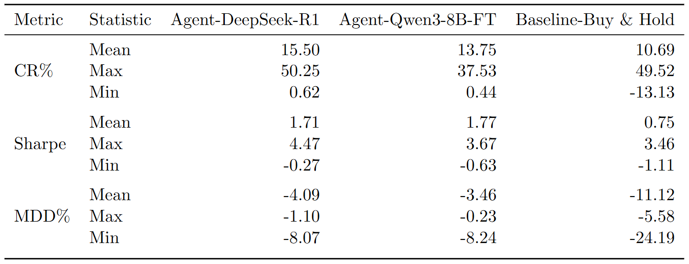
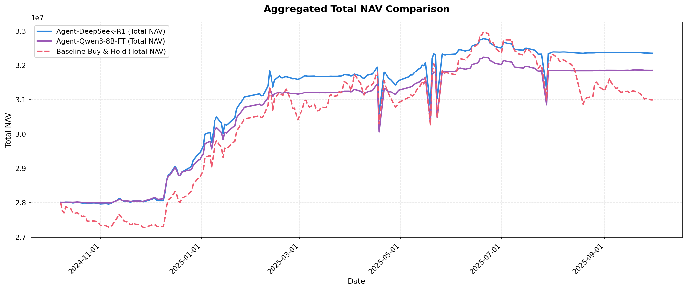

# 面向基础设施公募REITs的大语言模型多智能体投资系统

## 📖 项目简介

本研究面向低波动的中国基础设施公募REITs市场,提出一种基于多智能体协作的大型语言模型(LLMs)驱动交易框架。该系统构建公告、事件、价格动量与市场四类分析智能体,分别从不同维度进行分析;然后预测智能体融合上述多源信号,输出多时间尺度的方向概率分布;然后决策智能体依据预测结果与风控约束生成离散调仓信号,从而实现"分析-预测-决策-执行"的闭环。

本研究进一步对比了两种预测模型路径:直接调用通用大模型DeepSeek-R1与基于监督微调与强化学习对齐的专用小模型Qwen3-8B。在2024年10月至2025年10月的回测中,两种智能体策略在累计收益、夏普比率与最大回撤方面均显著优于买入持有基准。

---

## 📄 论文

论文地址: *待补充*


---

## 🏗️ 系统架构


系统采用分层设计,构建"分析-预测-决策-执行"的完整闭环:

### 1. 价格动量智能体 (Price Momentum Agent)

从价格走势、技术形态与成交量结构出发刻画公募REITs的市场行为,将低波动市场中分散的技术信号转化为可用于多智能体融合的结构化结论:

- **技术指标计算**: 计算MA5/10/20/60均线系统、RSI(6/12/24)、MACD、布林带(20,2σ)、成交量MA及量比等多类技术指标
- **动态波动阈值**: 针对REITs低波动特性,设计自适应波动阈值机制,基于短期历史波动率、自适应乘数和分位数边界计算每日动态阈值,用于判断价格变动是否具有统计意义
- **多时间尺度整盘定义**: 通过时间平方根法则将单日阈值扩展至T+5和T+20周期
- **LLM驱动综合**: 将趋势结构、动量状态、布林带位置、量价关系、支撑压力区间等信息组织为结构化上下文,由DeepSeek-R1进行联合推理,输出对当前价格阶段的判断及未来路径的技术含义

### 2. 公告智能体 (Announcement Agent)

评估公募REITs在近期信息披露下的公告驱动型价格冲击:

- **历史影响分析**: 对特定类型公告(季报、年报、中报、运营数据等)建立历史影响分析模块,从数据库提取同类型历史公告及其发布后特定交易日的价格表现
- **统计画像构建**: 按"利好/中性/利空"分组计算短期上涨概率、不同窗口的平均上涨比率、大幅波动频率等统计量
- **实时综合判断**: 收集分析日前7个自然日内的全部公告,结合历史统计反应和当前价格走势,由DeepSeek-R1输出对公告组合的结构化解读,判断影响在当前行情中更可能被放大还是衰减

### 3. 事件智能体 (Event Agent)

识别公募REITs的事件驱动阶段,判断近期是否出现足以影响定价的新闻催化、基础资产经营变化或季报预期博弈:

- **新闻分析**: 处理分析日前固定窗口内的市场新闻(重点关注影响大的新闻,越接近分析日权重越高)
- **经营数据跟踪**: 保留最近一期季报与季报发布后若干期运营数据报告,关注运营改善/恶化及是否达到正常水平
- **季报预警**: 判断当前时点是否接近季报发布时间,提示可能存在的提前调仓博弈行为
- **综合输出**: 由DeepSeek-R1输出关键新闻要点、基础资产经营变动情况、季报预警建议及综合分析与风险提示

### 4. 市场智能体 (Market Agent)

从利率环境、股市风险偏好与REITs市场自身估值状态三个核心维度,对公募REITs市场的整体配置环境进行宏观判断:

- **多层市场状态构建**: 基于REITs全收益指数、10年期国债收益率、股票指数(上证指数与中证红利指数)、REITs全市场成交与市值数据,计算大量量化指标并映射为可解释的状态标签
- **四象限宏观配置框架** (核心结构):
  - **横轴-利率趋势**: 以10年期国债收益率近20日变化幅度划分为明确下行/缓慢下行/横盘震荡/缓慢上行/明确上行,直接刻画REITs贴现率环境
  - **纵轴-股市状态**: 由上证指数20日涨跌幅与RSI联合划分为牛市/震荡偏强/震荡/震荡偏弱/熊市,反映资金流向偏好
  - **四象限定位**:
    - 象限I(利率下行+股市上涨): REITs估值受利率支撑但股市强势可能分流资金,谨慎乐观
    - 象限II(利率上行+股市上涨): 贴现率上升且资金流向股市,对REITs形成双重挤压,最不利环境
    - 象限III(利率下行+股市震荡或下跌): 估值受益于利率下降且资金回流稳健资产,最佳配置窗口
    - 象限IV(利率上行+股市下跌): 利率压制估值但股市走弱带来避险需求,REITs具有防御性但回报受限
- **LLM综合解读**: 由DeepSeek-R1在四象限框架下对多维信号进行一致性与主次矛盾分析,输出当前REITs市场所处环境的宏观判断

### 5. 预测智能体 (Direction Predictor)

接收上述四个智能体的结构化分析及价格上下文信息,由LLM输出在三个时间尺度(T+1、T+5、T+20)下的方向概率分布(上涨/下跌/整盘)及对应置信度,用于表达不同持有周期内的方向判断与不确定性水平。

**两种模型实现路径**:
- **通用大模型路径**: 直接调用DeepSeek-R1执行预测任务
- **微调小模型路径**: 对Qwen3-8B进行两阶段训练
  - **阶段一-监督微调(SFT)**: 使用教师模型(DeepSeek-R1)蒸馏生成训练数据,学习结构化推理链路和JSON格式输出
  - **阶段二-强化学习(GSPO)**: 通过奖励函数对齐真实价格变动,奖励函数包括三时间尺度方向预测准确性和结构化输出合规性
  - **训练数据**: 使用2023年10月-2024年9月共12个月的历史数据,仅选取上市时间超过1年的基金数据作为训练样本
  - **说明**: 本开源项目仅提供微调模型的预测结果数据及基于该预测结果的决策结果,不包含模型训练过程代码和训练后的模型权重

### 6. 决策智能体 (Decision Agent)

获得预测智能体的多时间尺度方向预测结果,以及当前账户状态和风控约束条件(仓位上限、固定额度调仓步长、建仓期节奏限制、风控规则等),由DeepSeek-R1输出一个离散化的调仓信号,系统将其映射为实际仓位变动并执行,更新账户信息。

---

## 📊 实证结果与回测表现

### 回测设定

- **回测区间**: 2024年10月至2025年10月,共12个月
- **样本选取**: 截至2024年10月1日已上市满一年的基金,共28只
- **账户模式**: 单资产独立回测,每只基金对应一个独立模拟账户,相同初始资金,仅交易对应基金
- **交易成本**: 每笔交易万分之三(0.03%)
- **对比策略**:
  - Agent-DeepSeek-R1: 预测任务由通用大模型DeepSeek-R1执行
  - Agent-Qwen3-8B-FT: 预测任务由微调小模型Qwen3-8B执行
  - Baseline-Buy & Hold: 回测期首日全仓买入并持有至结束

### 策略整体表现对比



表1展示了三种策略在全部28只基金上的统计表现。两种基于多智能体框架的策略在累计收益率(CR)、夏普比率(Sharpe)和最大回撤(MDD)上均显著优于传统的"买入并持有"策略:

- **累计收益率(CR)**: DeepSeek-R1路径平均15.50%,Qwen3-8B-FT路径平均13.75%,均明显高于基准的10.69%
- **夏普比率(Sharpe)**: Qwen3-8B-FT路径略高于DeepSeek-R1路径(1.77 vs 1.71),均远超基准的0.75,说明智能体在更稳健的风险结构下获得回报
- **最大回撤(MDD)**: 两种智能体策略的平均最大回撤均控制在-5%以内(-4.09%和-3.46%),而基准策略平均回撤超过-11%,极端情况下基准回撤可达-24.19%

### 综合净值曲线



图2展示了三种策略在回测期内全部基金账户综合总净值的走势对比。两个智能体策略整体呈现更平滑的上行路径,且在多次市场波动阶段的回撤幅度显著小于基准策略

结果表明,多智能体框架可有效提升REITs交易的风险调整后收益,且经过微调的小模型在部分场景下表现接近甚至优于通用大模型。

---

## 📂 项目结构

```
general_purpose_model_git/
├── config/                          # 配置文件
│   ├── db_config.py                # 数据库配置
│   └── model_config.py             # LLM模型配置
│
├── agent_announcement/             # 公告分析智能体
│   ├── announcement_historical_impact.py    # 公告历史影响分析
│   ├── announcement_recent_impact.py        # 近期公告影响分析
│   └── event_historical_impact_analyzer.py  # 事件历史影响分析
│
├── agent_event/                    # 事件分析智能体
│   └── event_analyzer.py          # 事件综合分析
│
├── agent_price/                    # 价格动量分析智能体
│   ├── price_analyzer.py          # 价格动量综合分析
│   └── daily_threshold_calculator.py  # 动态波动阈值计算
│
├── agent_market_analysis/          # 市场分析智能体
│   ├── data_fetcher.py            # 市场数据获取
│   ├── indicators_calculator.py    # 市场指标计算
│   └── market_analyzer.py         # 市场四象限分析
│
├── agent_direction/prediction/     # 方向预测智能体
│   ├── data_manager.py            # 数据管理
│   ├── experts_caller.py          # 四专家调用器
│   ├── price_context_calculator.py # 价格上下文计算
│   ├── direction_predictor.py     # 方向预测(融合层)
│   ├── db_writer.py              # 预测结果写入
│   └── main.py                   # 预测流程主控
│
├── agent_trading/                  # 决策与交易执行
│   ├── core/                      # 核心交易组件
│   │   ├── account.py            # 账户管理
│   │   ├── action_executor.py    # 交易执行器
│   │   ├── risk_controller.py    # 风控模块
│   │   ├── signal_processor.py   # 信号处理
│   │   └── state_builder.py      # 状态构建
│   ├── data/                      # 数据获取
│   │   ├── data_fetcher.py
│   │   └── db_manager.py
│   ├── llm/                       # LLM调用
│   │   ├── llm_caller.py         # 决策LLM调用
│   │   └── prompt_builder.py     # 提示词构建
│   └── run_strong_llm.py         # 交易主程序
│
├── baseline_strategies/            # 基准策略
│   └── buy_and_hold/              # 买入持有策略
│       ├── strategy.py
│       ├── account.py
│       └── data_fetcher.py
│
├── data/                          # 数据文件
│   ├── price_predictions.csv                 # 原始模型(DeepSeek-R1)预测结果
│   ├── trading_decisions_strong.csv          # 原始模型交易决策结果
│   ├── price_predictions_trained_model.csv   # 微调模型预测结果
│   ├── trading_decisions_trained_model.csv   # 基于微调模型预测结果的交易决策结果
│   ├── price_data.csv                       # 价格数据
│   ├── dividend.csv                         # 分红数据
│   ├── product_info.csv                     # 基金信息
│   ├── processed_files.csv                  # 公告数据
│   ├── index_price_data.csv                 # 指数数据
│   ├── industry_indices.csv                 # 行业指数
│   ├── news.csv                            # 新闻数据
│   ├── baseline_buy_hold.csv               # 基准策略结果
│   └── 数据库表说明文档.txt                  # 数据说明
│
├── diagram-zh.png                 # 系统架构图
├── aggregated_total_nav_comparison.png  # 净值对比图
├── table1.png                     # 表现对比表
└── README.md                      # 本文件
```

---


## ⚖️ 免责声明

本项目仅供学术研究使用。项目中的所有策略、模型和数据分析结果均基于历史数据回测,不构成任何投资建议。实际投资决策应综合考虑个人风险承受能力、市场环境变化等多种因素。使用本项目代码或方法进行实盘交易的任何盈亏,均由使用者自行承担。

---

